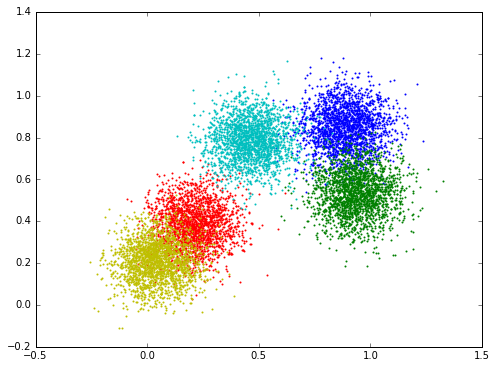

Logistic regression tutorial
============================

This part of tutorial is derived from its step-by-step notebook version 
`multinomial logistic regression example <https://github.com/dmlc/minpy/blob/master/examples/demo/minpy_tutorial.ipynb>`_,
the emphasis is to showcase the basic capacity of MinPy.

We will work on a classification problem of a synthetic data set. Each point is a high-dimentional data in
one of the five clusters. We will build a one-layer multinomial logistic regression model. The goal is to learn
a weight matrix ``weight``, such that for a data point ``x`` the probability that it is assigned to its class (cluster)
is the largest.

The data is generated with the following code.

.. literalinclude:: make_data_gist.py
  :language: python
  :linenos

The visualization of the data:

This is the numpy version. The function ``predict`` outputs the probability, the ``train`` function iterates
over the data, computes the loss, the gradients, and updates the parameters ``w`` with a fixed learning rate.

.. literalinclude:: logistic_regression_np.py
  :language: python
  :linenos:
  
The minpy version is very similar, except a few lines that are highlighted:

* Imports ``minpy.numpy`` instead of ``numpy``. This lightweight library is fully numpy compatible, but it allows us
  to add small instrumentations in the style of `autograd <https://github.com/HIPS/autograd>`_ 
* Defines *loss* explicitly with the function ``loss``
* Minpy derives a function to compute gradients automatically

.. literalinclude:: logistic_regression_mp.py
  :language: python
  :linenos:
  
Now, with one line change, the same code runs on GPU as well! For more functionality of Minpy/MXNet, we invite you
to read later sections of this tutorial.
