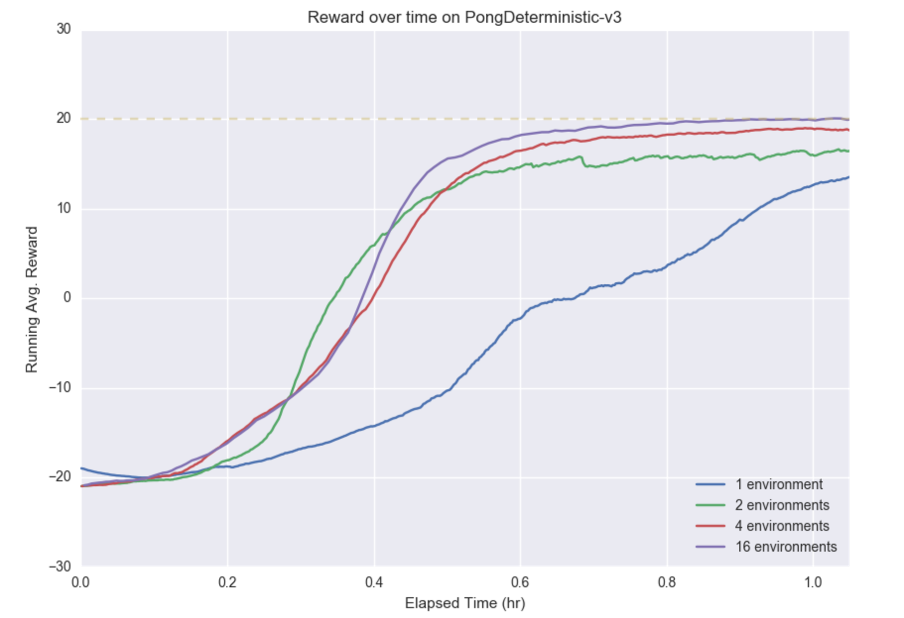
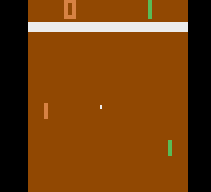

Reinforcement learning with policy gradient
===========================================

Deep Reinforcement Learning (RL) is another area where deep models are used. In this example, we
implement an agent that learns to play Pong, trained using policy gradients. Since we are using MinPy,
we avoid the need to manually derive gradient computations, and can easily train on a GPU.

The example is based on the problem and model described in `Deep Reinforcement Learning: Pong from Pixels <http://karpathy.github.io/2016/05/31/rl/>`_ ,
which contains an introduction and background to the ideas discussed here.

The training setups in reinforcement learning often differ based on the approach used, making MinPy's flexibility a great choice for prototyping RL models.
Unlike the standard supervised setting, with the policy gradient approach the training data is generated
during training by the environment and the actions that the agent chooses, and stochasticity is
introduced in the model.

Specifically, we implement a ``PolicyNetwork`` that learns to map states (i.e. visual frames of the Pong game)
to actions (i.e. 'move up' or 'move down'). The network is trained using the ``RLPolicyGradientSolver``.

See `here <https://github.com/dmlc/minpy/blob/master/examples/rl/>`_ for the full implementation.

PolicyNetwork
-------------
The forward pass of the network is separated into two steps:

  1. Compute a probability distribution over actions, given a state.
  2. Choose an action, given the distribution from (1).

These steps are implemented in the ``forward`` and ``choose_action`` functions, respectively:

.. literalinclude:: pong_model1.py
  :language: python
  :linenos:

In the ``forward`` function, we see that the model used is a simple feed-forward network that takes
in an observation ``X`` (a preprocessed image frame) and outputs the probability ``p`` of taking the 'move up' action.

The ``choose_action`` function then draws a random number and selects an action according to the
probability from ``forward``.

For the ``loss`` function, we use cross-entropy but multiply each observation's loss by the associated
discounted reward, which is the key step in forming the policy gradient:

.. literalinclude:: pong_model2.py
  :language: python
  :linenos:

Note that by merely defining the ``forward`` and ``loss`` functions in this way, MinPy will be able to automatically compute the proper gradients.

Lastly, we define the reward discounting approach in ``discount_rewards``, and define the preprocessing
of raw input frames in the ``PongPreprocessor`` class:

.. literalinclude:: pong_model3.py
  :language: python
  :linenos:

See `here <https://github.com/dmlc/minpy/blob/master/examples/rl/policy_gradient/pong_model.py>`_ for the full implementation.

RLPolicyGradientSolver
----------------------
The ``RLPolicyGradientSolver`` is a custom ``Solver`` that can train a model that has the functions discussed above.
In short, its training approach is:

    1. Using the current model, play an episode to generate observations, action labels, and rewards.
    2. Perform a forward and backward pass using the observations, action labels, and rewards from (1).
    3. Update the model using the gradients found in (2).

Under the covers, for step (1) the ``RLPolicyGradientSolver`` repeatedly calls the model's ``forward`` and ``choose_action`` functions at each
step, then uses ``forward`` and ``loss`` functions for step 2.

See `here <https://github.com/dmlc/minpy/blob/master/examples/rl/policy_gradient/rl_policy_gradient_solver.py>`_ for the full implementation.

Training
--------
Run `pong_model.py <https://github.com/dmlc/minpy/blob/master/examples/rl/policy_gradient/pong_model.py>`_ to train the model.
The average running reward is printed, and should generally increase over time. Here is a video
showing the agent (on the right) playing after 18,000 episodes of training:

.. image:: pong.gif
  :align: center
  :width: 50%

While this example uses a very simple feed-forward network, MinPy makes it easy to experiment with more complex architectures,
alternative pre-processing, weight updates, or initializations!

Dependencies
------------------
Note that `Open AI Gym <https://gym.openai.com/>`_ is used for the environment.

Improved RL with Parallel Advantage Actor-Critic
=======================================================
The example above shows a basic model trained using the simplest policy gradient estimator,
known as REINFORCE [1]_. This gradient estimator is known to have high variance, resulting in slow training. Moreover, with the
model and training process above we are limited to obtaining trajectories from a single environment at a time.

In this tutorial, we will address these issues by using an alternative gradient estimator with lower variance and
introducing parallelism. In the end, we will be able to train a model to solve Pong in around an
hour on a MacBook Pro [*]_. All code can be found `here <https://github.com/dmlc/minpy/tree/master/examples/rl/parallel_actor_critic>`_.

We use ideas from the `Asynchronous Actor-Critic (A3C) <https://arxiv.org/abs/1602.01783>`_ [2]_
algorithm. Broadly speaking A3C has two key features: asynchronous training that simultaneously
uses trajectories from multiple environments, and the use of an estimated advantage function to
reduce the variance of the policy gradient estimator.

Parallel training
-----------------
A3C consists of a global model, with separate worker processes that have a local copy of the model.
Each worker collects trajectories from its own environment, makes updates to the global model,
then syncs its local model copy. Thus with `n` worker processes, updates are made using trajectories
from `n` environments. Another feature of A3C is that updates are made every `t_max` (e.g. 20) steps
instead of performing a single update per episode.

One insight is that we can achieve similar behavior as A3C without using multiple processes or
copies of the model, when interacting with the environment is not expensive.

Instead, we can maintain `n` copies of the environment and at each step sequentially obtain `n`
observations, then predict `n` different actions with the model using a single forward pass:

.. literalinclude:: parallel_tutorial1.py
  :language: python

Then we can assemble the trajectories obtained from the `n` environments into a batch and update
the model using a single backward pass:

.. literalinclude:: parallel_tutorial2.py
  :language: python

Thus the training is parallel in the sense that the trajectories are processed in the forward and
backward passes for all environments in parallel. See
`train.py <https://github.com/dmlc/minpy/blob/master/examples/rl/parallel_actor_critic/train.py>`_
for the full implementation.

Since updates occur every `t_max` steps, the memory requirement for a forward and
backward pass only increases marginally as we add additional environments, allowing many
parallel environments. The number of environments is also not limited by the number of CPU cores.

One difference with A3C is that since the updates are not performed asynchronously, the most recent
model parameters are always used to obtain trajectories from each environment. However,
since the environments are independent the policy still explores different trajectories
in each environment. Intuitively, this means that the overall set of samples used for training
becomes more 'diverse' as we introduce more environments.

Improved gradient estimator
---------------------------
The 'Advantage Actor-Critic' in A3C refers to using an estimated advantage function to reduce the
variance of the policy gradient estimator. In the REINFORCE policy gradient, the discounted return
is used to decide which direction to update the parameters:

.. math::

   \nabla_{\theta} \log \pi_{\theta}(a_t|s_t)R_t

Where :math:`R_t` is the total discounted return from time step :math:`t` and
:math:`\pi_{\theta}(a_t|s_t)` is the probability of taking action :math:`a_t` from state
:math:`s_t`, given by the policy :math:`\pi_{\theta}`.

Alternatively, with an advantage function the direction of parameter updates is based on whether
taking a certain action leads to higher expected return than average, as measured by the
advantage function :math:`A(s_t,a_t)`:

.. math::

   \nabla_{\theta} \log \pi_{\theta}(a_t|s_t)A(s_t, a_t)

.. math::
   A(s_t, a_t) = Q(s_t,a_t) - V(s_t)

Where :math:`Q(s,a)` is the action-value function that gives the expected return of taking action
:math:`a_t` from state :math:`s_t`, and :math:`V(s_t)` is the state-value function, which gives
the expected return from state :math:`s_t`.

Although the function :math:`Q(s,a)` is unknown, we can approximate it using the discounted
returns :math:`R`, resulting in an estimated advantage function:

.. math::

   \tilde{A}(s_t, a_t) = R_t - V(s_t)

An alternative estimator of the advantage function known as the
`Generalized Advantage Estimator <https://arxiv.org/abs/1506.02438>`_ (GAE) [3]_ has been developed
by Schulman et al., which we implement here. The Generalized Advantage Estimator is as follows:

.. math::

   \tilde{A_t} = \sum_{l=0}^{\infty}(\gamma\lambda)^l\delta_{t+l}^V

.. math::

   \delta_{t}^V=r_t + \gamma V(s_{t+1}) - V(s_t)

Where :math:`r_t` is the reward obtained at timestep :math:`t`, and :math:`V(s_t)` is the
state-value function, which we approximate in practice. :math:`\gamma` and :math:`\lambda`
are fixed hyper-parameters in :math:`(0,1)`.

To implement GAE, we therefore need to (a) implement the state-value function, (b) compute the
advantages according to the equation above, and (c) modify the loss so that it uses the advantages
and trains the state-value function.

(a) State-Value Function
~~~~~~~~~~~~~~~~~~~~~~~~
We approximate the state-value function by modifying the policy network to produce an additional
output, namely the value of the input state. Here, the state-value function is simply a linear
transformation of the same features used to compute the policy logits:

.. literalinclude:: parallel_tutorial3.py
  :language: python
  :emphasize-lines: 10-11
  :linenos:

(b) Compute Advantages
~~~~~~~~~~~~~~~~~~~~~~
After assembling a batch of trajectories, we compute the discounted rewards used to train the
value function, and the :math:`\delta` terms and the advantage estimates for the
trajectories from each environment.

.. literalinclude:: parallel_tutorial4.py
  :language: python
  :linenos:

Notice the subtlety in the way we discount the rewards that are used to train the
state-value function. If a trajectory ended mid-episode, we won't know the actual future return
of the trajectory's last state. Therefore we 'bootstrap' the future return for the last state
by using the value function's last estimate.

(c) Loss Function
~~~~~~~~~~~~~~~~~~~~~~
The loss function then uses the advantage estimates. A term is added to train the value function's
weights, using L2-loss with the observed discounted rewards as the ground truth. Finally, as noted
in the A3C paper, an entropy term can be added that discourages the policy from collapsing to a
single action for a given state, which improves exploration.

.. literalinclude:: parallel_tutorial5.py
  :language: python
  :linenos:

See
`model.py <https://github.com/dmlc/minpy/blob/master/examples/rl/parallel_actor_critic/model.py>`_
for the full implementation.

Experiments
-----------
To see the effects of advantage estimation and parallel training, we train the model with 1, 2, 4,
and 16 environments.

The plot shows the running average reward over time for various numbers of environments during the first hour of training.
We can see that the improved gradient estimator allows all models to train
quickly.
Using 16 environments, the game is solved in around an hour.

We see that increasing the number of environments increases convergence speed in terms of wall-clock time; using 4 or 16 environments results in approaching the faster than using 2 environments or a single environment. This indicates that the increased number of samples per update outweighs the cost of processing the samples.

Moreover, training stability improves as more environments are used, as shown by the smooth, monotonic improvement with 16 environments versus the jagged, noisy improvement with 1 and 2 environments. One possible reason is that with more parallel environments, the samples used to update the policy are more diverse.

While a detailed analysis is outside the scope of this tutorial, we can see that the parallel Advantage Actor-Critic approach can train a model on the Pong environment in a fast and robust manner.

Note that we have kept the structure of the policy network the same as before; it is still a simple
feed-forward network with 1 hidden layer.

Running
-------
To train the model with default parameters, run:

.. code-block:: bash

   python train.py

Here is a video showing the model after around an hour of training:

Feel free to experiment with other environments (which may require additional tuning),
network architectures, or to use the code as a starting point for further research.
For instance, we can also solve the CartPole environment:

.. code-block:: bash

   python train.py --env-type CartPole-v0

.. [*] Consistent with the Open AI A3C implementation [4]_, we use the PongDeterministic-V3
        environment, which uses a frame-skip of 4. For this experiment, we define 'solved' as
        achieving a running average score of 20 out of 21 (computed using the previous 100
        episodes). Note that for this version of Pong, humans were only able to achieve a score of
        -11 [5]_.

.. rubric:: Reference

.. [1] Williams, R.J. Simple statistical gradient-following algorithms for connectionist
        reinforcement learning. Machine Learning, 8(3):229–256, 1992.

.. [2] Volodymyr Mnih, Adria Puigdomenech Badia, Mehdi Mirza, Alex Graves, Timothy P. Lillicrap,
        Tim Harley, David Silver, and Koray Kavukcuoglu. Asynchronous methods for deep reinforcement
        learning. In Proceedings of the 33rd International Conference on Machine Learning (ICML),
        pp. 1928–1937, 2016.

.. [3] Schulman, John, Moritz, Philipp, Levine, Sergey, Jordan, Michael, and Abbeel, Pieter.
        High-dimensional continuous control using generalized advantage estimation. arXiv
        preprint arXiv:1506.02438, 2015b.

.. [4] https://github.com/openai/universe-starter-agent#atari-pong. The A3C implementation in this
        repository was used as a reference when implementing the above.

.. [5] https://openai.com/blog/universe/
