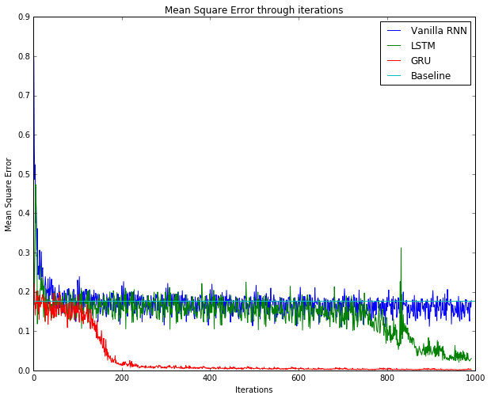

RNN Tutorial
============

This tutorial describes how to implement recurrent neural network (RNN) on
MinPy. Since RNN has different architecture compared to traditional
pipelines, it is hard to be implemented on many machine learning systems. MinPy
simplifies RNN implementation by its focus on imperative programming.
This tutorial will explain how RNN can be implemented easily on MinPy.

We do suggest you start with :ref:`complete_solver_guide` for MinPy's
conventional solver architecture.

Toy Dataset: the Adding Problem
-------------------------------

The adding problem is a toy dataset for RNN used by many researchers. The input
data of the dataset consists of two rows. The first row contains random float
numbers between 0 and 1; the second row are all zeros, expect two randomly
chosen locations being marked as 1. The corresponding output label is a float
number summing up two numbers in the first row of the input data where marked as
1 in the second row. The length of the row ``T`` is the length of the input
sequence.

.. figure:: img/adding_problem.png

    Figure: An example of the adding problem. 0.7 and 0.5 are chosen from the input data
    on the left and sum up as 1.2, the label on the right [1].

The paper [1] indicates that a less than 0.1767 Mean Square Error (MSE) proves the effectiveness
of the network compared to the random guess. We set 0.1767 as the MSE baseline of our experiment.

We prepared an adding problem generator at ``examples.utils.data_utils.adding_problem_generator`` (
`here <https://github.com/dmlc/minpy/blob/master/examples/utils/data_utils.py>`_). We append its
implementation as follows:

.. literalinclude:: adding_problem_generator.py
  :language: python
  :linenos:

Vanilla RNN
-----------

In :ref:`complete_solver_guide`, we introduced a simple model/solver architecture.
Implementing RNN in MinPy is very straightforward following the convention. The only
difference is the model part. The following MinPy code defines the vanilla RNN in
``RNNNet`` class. We also include solver code for completeness.

.. literalinclude:: rnn.py
  :language: python
  :linenos:

Layers are defined in ``minpy.nn.layers`` (`here <https://github.com/dmlc/minpy/blob/master/minpy/nn/layers.py>`_).

The key layer of vanilla RNN is also shown as follows:

.. literalinclude:: rnn_step.py
  :language: python
  :linenos:

We see building rnn through imperative programming is both convenient and intuitive.

LSTM
----

LSTM was introduced by Hochreiter and Schmidhuber. It adds more gates to control the
process of forgetting and remembering. LSTM is also quite easy to implement in MinPy
like vanilla RNN:

.. literalinclude:: lstm.py
  :language: python
  :linenos:

Layers are defined in ``minpy.nn.layers`` (`here <https://github.com/dmlc/minpy/blob/master/minpy/nn/layers.py>`_).

The key layer of LSTM is also shown as follows:

.. literalinclude:: lstm_step.py
  :language: python
  :linenos:

The implementation of ``lstm_step`` is quite straightforward in MinPy.

GRU
---

GRU was proposed by Cho et al. [3]. It simplifies LSTM by using less gates and states.
MinPy can also model GRU in an intuitive way:

.. literalinclude:: gru.py
  :language: python
  :linenos:

Layers are defined in ``minpy.nn.layers`` (`here <https://github.com/dmlc/minpy/blob/master/minpy/nn/layers.py>`_).

The key layer of GRU is also shown as follows:

.. literalinclude:: gru_step.py
  :language: python
  :linenos:

``gru_step`` stays close with ``lstm_step`` as expected.

Training Result
---------------

We trained recurrent networks shown early in this tutorial and use ``solver.loss_history`` to retrieve the MSE
history in the training process. The result is as follows.

    Figure: Result of training vanilla RNN, LSTM, GRU. A baseline of 0.1767 is also included.

We observe that LSTM and GRU are more effective than vanilla RNN due to LSTM and GRU's memory gates.
We also see that GRU converges much faster than LSTM because its fewer parameters.

Reference
---------

[1]	Q. V. Le, N. Jaitly, and G. E. Hinton, “A Simple Way to Initialize Recurrent Networks
of Rectified Linear Units,” arXiv.org, vol. cs.NE. 04-Apr-2015.

[2]	S. Hochreiter and J. Schmidhuber, “Long Short-Term Memory,” Neural Computation,
vol. 9, no. 8, pp. 1735–1780, Nov. 1997.

[3] K. Cho, B. van Merrienboer, C. Gulcehre, D. Bahdanau, F. Bougares, H. Schwenk,
and Y. Bengio, “Learning Phrase Representations using RNN Encoder-Decoder for Statistical
Machine Translation,” arXiv.org, vol. cs.CL. 04-Jun-2014.